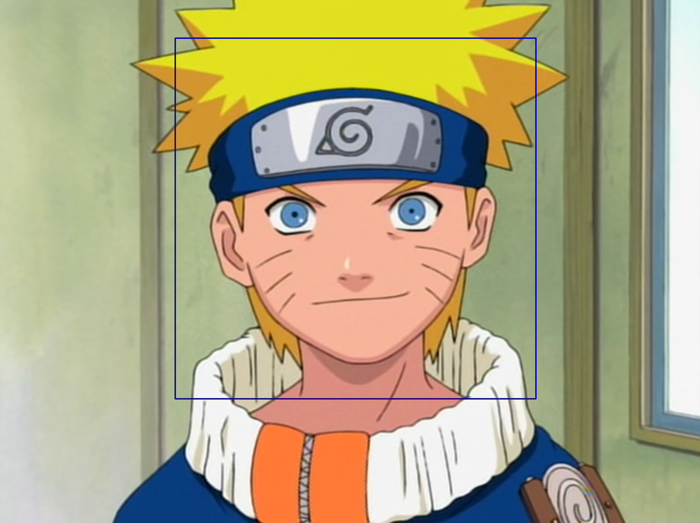

# anime_face_detect

## Datasets used:
- Positives: Anime Face Dataset (Mckinsey666)  
https://github.com/Mckinsey666/Anime-Face-Dataset
- Negatives: Haar Training Negatives (sonots)  
https://github.com/sonots/tutorial-haartraining/tree/master/data/negatives

## Scripts used: 
- Merging .vec files: mergevec.py (wulfebw)  
https://github.com/wulfebw/mergevec

## Creation and training process
1. Using your desired negatives training set, create an info file (ex. negatives.txt) of each negative image path, for example:  
````ls -A1 negatives > negatives.txt````

2. Create training samples via create_samples.py, specifying the directory of positives (ex. positives), background image info file (ex. negatives.txt), location of your vector directory (ex. samples), total number of training samples, and number of training samples per image. This will create a bunch of .vec files.

3. Via mergevec.py (credit wulfebw), combine the .vec files into one .vec file.

4. Train mergevec.py via OpenCV traincascade. I used a 48x48 model image size, LBP feature type, and 18 stages, along with default number of positives and negatives (2,000 and 1,000).  
````opencv_traincascade -data Classifiers -vec train_samples.vec -bg negatives.txt -numStages 18 -featureType LBP -w 48 -h 48````

5. Use detect.py on an image. Example:  


## Flask API
### POST /detect
Returns bounding box information for each face detected in the image. Takes in a base-64 encoded string `"content"`.

**Request body:** `{ "content" : "<base64-encoded string>" }`

**Example response body:** `{ 'detected': [{ 'x': 1006, 'y': 305, 'w': 125, 'h': 125 }, { 'x': 348, 'y': 101, 'w': 737, 'h': 737 }] }`

**Example call:**  
  ```python
     headers = {"content-type" : "application/json" }
     jpg_as_text = base64.b64encode(sample_jpg_img)
     response = requests.post(http://localhost:5000/detect, json={"content" : jpg_as_text.decode("utf-8")}, headers=headers)
  ```

### POST /auto_crop
Returns cropped image of largest detected face. Takes in a base-64 encoded string `"content"`.

**Request body:** `{ "content" : "<base64-encoded string>" }`

**Response body:** `{ "image" : "<base64-encoded string>" }] }`

**Example call:**  
  ```python
     headers = {"content-type" : "application/json" }
     jpg_as_text = base64.b64encode(sample_jpg_img)
     response = requests.post(http://localhost:5000/auto_crop, json={"content" : jpg_as_text.decode("utf-8")}, headers=headers)
  ```

